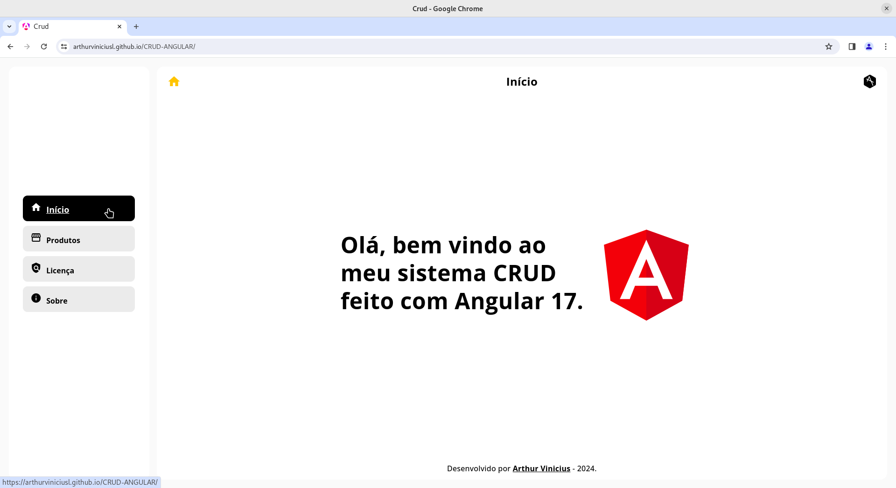
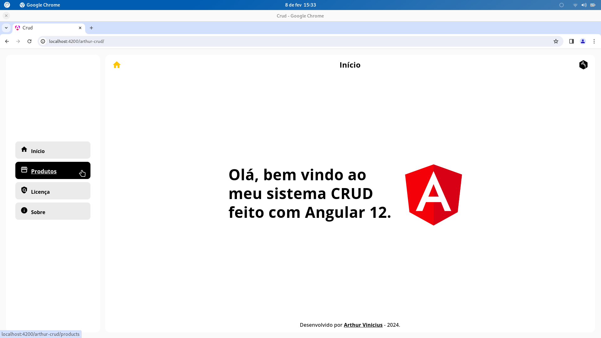
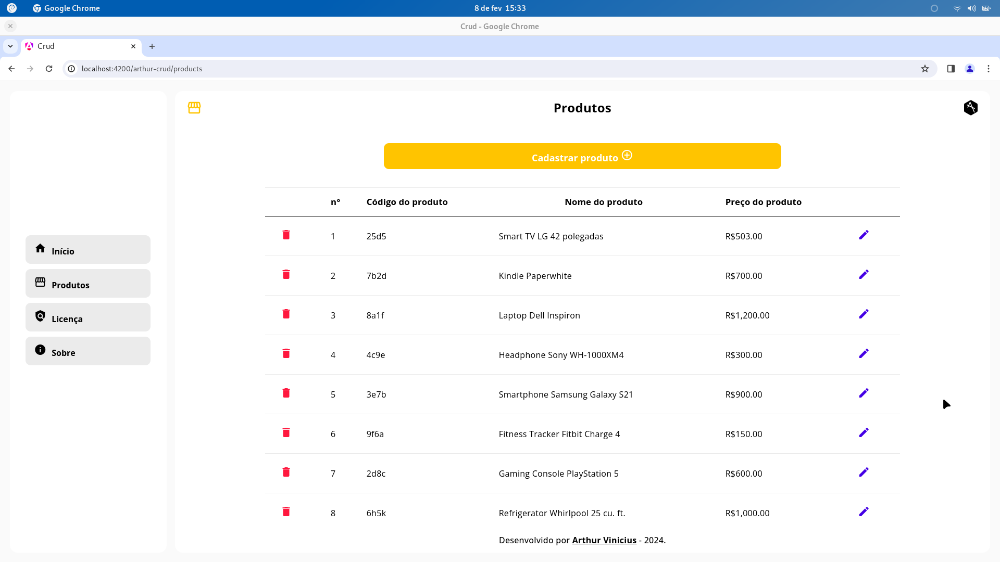
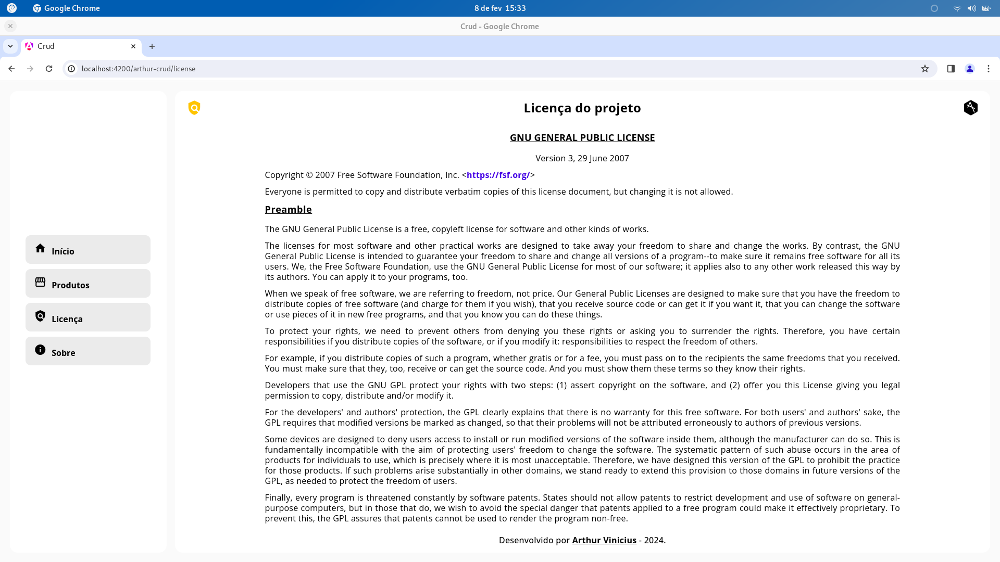

# CRUD-ANGULAR

## Preview
- Início
  
- Produtos
  
  
- Licença
  
---
## Como testar?
1. Primeiro você deverá ter o node e o npm instalados no seu sistema.
   >Caso você também seja usuário linux, execute:
   ```
   sudo apt-get install nodejs npm
   ```
3. Instale as dependências do projeto:
   ```
   npm install
   ```
4. Dentro da pasta "frontend" execute:
   ```
   npm start
   ```
5. Dentro da pasta "backend" execute:
   ```
   npm start
   ```

6. Por fim acesse no seu navegador o endereço:
   ```
    http://localhost:4200/
   ```

---
## Sobre
 Este projeto é o fruto do meue estudo e prática com Angular 12. A proposta central aqui foi desenvolver um projeto do tipo CRUD, utilizando o Angular como framework front-end e para simular o comportamento de um servidor back-end, optei por incorporar o JSON Server.

O que me motivou a o escolher o Angular foi o interesse em explorar seu ecossistema de criação de interfaces interativas e responsivas. A versão 12, à época do desenvolvimento, ofereceu as mais recentes funcionalidades e melhorias, proporcionando um ambiente propício para a criação de aplicações web modernas.

O uso do JSON Server como emulador de back-end acrescenta uma camada valiosa ao projeto. Isso permitiu a criação de um ambiente simulado para testes e desenvolvimento, viabilizando a execução de operações CRUD sem depender de um servidor real.

Ao longo do processo, enfatizei boas práticas de programação, design responsivo e a implementação de um código limpo e modular. Dessa forma, o projeto não apenas atende às funcionalidades básicas de um CRUD, mas também destaca-se pela organização e legibilidade do código.

